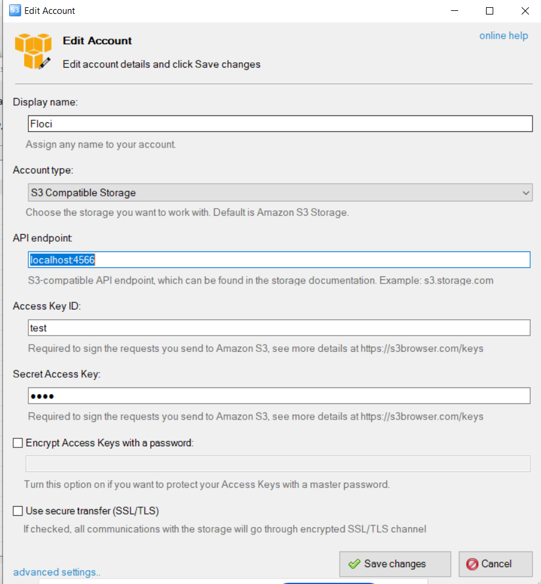
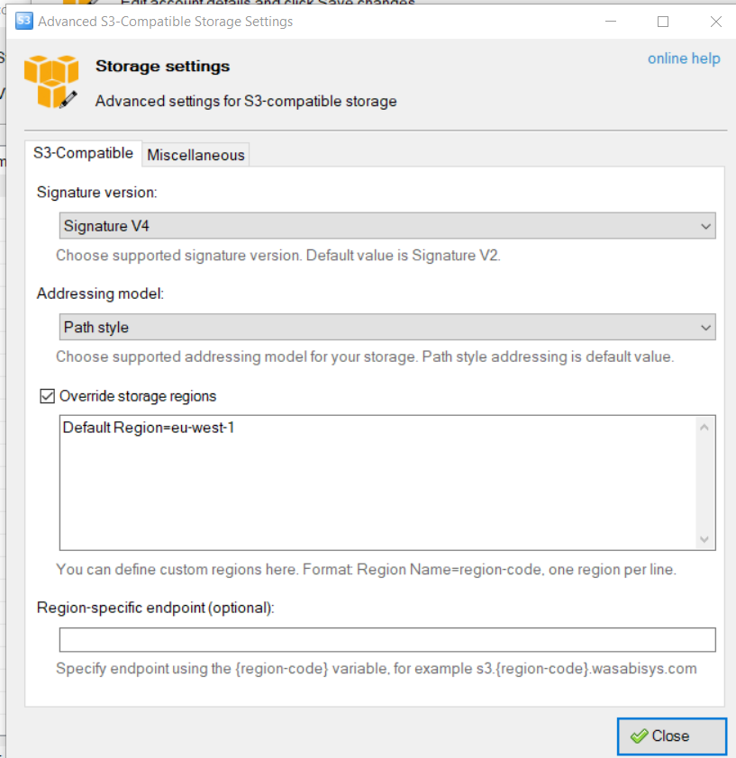

# Running Locally with Floci


# Running Locally with Floci

## Table of Contents

- [Running Locally with Floci](#running-locally-with-floci)
- [Running Locally with Floci](#running-locally-with-floci-1)
  - [Table of Contents](#table-of-contents)
  - [AWS Services Covered](#aws-services-covered)
  - [Prerequisites](#prerequisites)
  - [Step 1 — Create the Docker Compose file](#step-1--create-the-docker-compose-file)
  - [Step 2 — Create the Terraform provider override](#step-2--create-the-terraform-provider-override)
  - [Step 3 — Initialize Terraform](#step-3--initialize-terraform)
  - [Step 4 — Plan and apply](#step-4--plan-and-apply)
  - [Step 5 — Verify resources with the AWS CLI](#step-5--verify-resources-with-the-aws-cli)
  - [Teardown](#teardown)
  - [Troubleshooting](#troubleshooting)
  - [How to use Floci with AWS CLI](#how-to-use-floci-with-aws-cli)
  - [S3 Browser Setup](#s3-browser-setup)
  - [Invoke API REST in Gateway](#invoke-api-rest-in-gateway)

[Floci](https://github.com/floci-io/floci) is a free, open-source local AWS emulator — the MIT-licensed successor to LocalStack Community (which was sunset in March 2026). It exposes 45+ AWS-compatible services at `http://localhost:4566`, accepts any non-empty credentials, and requires no AWS account.

## AWS Services Covered

All five services used by this project are fully emulated by Floci:

| Service | Floci support |
|---|---|
| S3 | REST XML — buckets, objects, event notifications |
| SQS | Query / JSON — queues, dead-letter queues |
| Lambda | Real Docker execution via AWS Lambda runtime images |
| IAM | Query — roles, policies, attachments |
| CloudWatch Logs & Alarms | JSON 1.1 / Query — log groups, metric alarms |

> **Lambda runs in a real Docker container.** Floci pulls `public.ecr.aws/lambda/python:<runtime>` automatically, so the Docker socket must be mounted.

---

## Prerequisites

- Docker Desktop (running)
- Terraform ≥ 1.15 (matches `terraform.tf`)
- AWS CLI v2 (optional — useful for verifying resources)

---

## Step 1 — Create the Docker Compose file

Create `docker-compose.yml` at the **project root**:

```yaml
# docker-compose.yml
services:
  floci:
    image: floci/floci:latest
    ports:
      - "4566:4566"
    volumes:
      - /var/run/docker.sock:/var/run/docker.sock   # required for Lambda
      - ./floci-data:/app/data
    environment:
      FLOCI_HOSTNAME: localhost
      FLOCI_DEFAULT_REGION: eu-west-1
      FLOCI_DEFAULT_ACCOUNT_ID: "000000000000"
      FLOCI_STORAGE_MODE: hybrid                    # persists state across restarts
      FLOCI_SERVICES_LAMBDA_HOT_RELOAD_ENABLED: "true"
```

Start Floci in detached mode:

```powershell
docker compose up -d
```

Verify it is healthy (the endpoint returns `{"status":"running"}`):

```powershell
Invoke-RestMethod http://localhost:4566/_floci/health
```

---

## Step 2 — Create the Terraform provider override

The existing `providers.tf` uses `profile = var.aws_profile`, which would try to load real AWS credentials. Create an override file that substitutes dummy credentials and redirects every service endpoint to Floci.

Create `infra/provider_override.tf`:

```hcl
# infra/provider_override.tf
# Local-only override — already excluded by .gitignore (*_override.tf).
# Do NOT commit this file.

provider "aws" {
  region     = "eu-west-1"
  access_key = "test"
  secret_key = "test"

  skip_credentials_validation = true
  skip_metadata_api_check     = true
  skip_requesting_account_id  = true
  s3_use_path_style           = true   # required for path-style S3 URLs with Floci

  endpoints {
    cloudwatch = "http://localhost:4566"
    iam        = "http://localhost:4566"
    lambda     = "http://localhost:4566"
    logs       = "http://localhost:4566"
    s3         = "http://localhost:4566"
    sqs        = "http://localhost:4566"
    sts        = "http://localhost:4566"
  }
}
```

Terraform merges `*_override.tf` files with matching blocks in the main configuration. The `access_key` / `secret_key` here replace the profile-based auth, and the `endpoints` block redirects all API calls to Floci. The file is already excluded from version control by the existing `.gitignore` rule `*_override.tf`.

---

## Step 3 — Initialize Terraform

Move into the `infra/` directory and initialise:

```powershell
cd infra
terraform init
```

Because `backend "local" {}` is configured, state is stored in `infra/terraform.tfstate` — no S3 backend is needed for local runs.

---

## Step 4 — Plan and apply

```powershell
terraform plan
terraform apply -auto-approve
```

Terraform reads `terraform.tfvars` for default values and the override file for provider settings. The account ID returned by STS will be `000000000000` (Floci's default), so bucket names will resolve to:

| Variable | Value |
|---|---|
| `source_bucket_name` | `s3-source-000000000000` |
| `destination_bucket_name` | `s3-destination-000000000000` |

If you want shorter names, pass explicit values:

```powershell
terraform apply -auto-approve `
  -var="source_bucket_name=local-source" `
  -var="destination_bucket_name=local-destination"
```

---

## Step 5 — Verify resources with the AWS CLI

Point the CLI at Floci by setting the endpoint URL:

```powershell
$env:AWS_ACCESS_KEY_ID     = "test"
$env:AWS_SECRET_ACCESS_KEY = "test"
$env:AWS_DEFAULT_REGION    = "eu-west-1"
$env:AWS_ENDPOINT_URL      = "http://localhost:4566"
```

Then use the CLI as usual:

```powershell
# List S3 buckets
aws s3 ls

# List SQS queues
aws sqs list-queues

# List Lambda functions
aws lambda list-functions

# List IAM roles
aws iam list-roles --query "Roles[*].RoleName"

# List CloudWatch log groups
aws logs describe-log-groups

# List last log stream
aws logs describe-log-streams --log-group-name "/aws/lambda/file-processor" --order-by "LastEventTime" --descending --max-items 1
```

Upload a test file to trigger the Lambda via the S3 event notification:

```powershell
echo '{"test": true}' | Out-File -FilePath test.json -Encoding utf8
aws s3 cp test.json s3://s3-source-000000000000/test.json

# Check CloudWatch Logs for Lambda output
aws logs tail /aws/lambda/file-processor --follow
```

---

## Teardown

Destroy the Terraform-managed resources:

```powershell
terraform destroy -auto-approve
```

Stop and remove the Floci container (from the project root):

```powershell
cd ..
docker compose down
```

To also remove persisted state:

```powershell
docker compose down -v
Remove-Item -Recurse -Force floci-data
```

---

## Troubleshooting

| Symptom | Likely cause | Fix |
|---|---|---|
| `no such host` or connection refused | Floci container not running | `docker compose up -d` and re-check port 4566 |
| `InvalidClientTokenId` | Provider still using real AWS profile | Confirm `provider_override.tf` exists in `infra/` |
| Lambda never invoked after S3 upload | Docker socket not mounted | Ensure `/var/run/docker.sock` is in the volume list in `docker-compose.yml` |
| S3 bucket name conflict | Account ID mismatch | Pass explicit bucket names via `-var` flags |
| `s3_use_path_style` warning | AWS provider version mismatch | Requires AWS provider `~> 5.0`+; already satisfied by `~> 6.0` |
| State file references real ARNs after switch | Leftover state from a previous real AWS run | Run `terraform destroy` first, then delete `terraform.tfstate` |

## How to use Floci with AWS CLI

Add a new `floci` profile under your `.aws/credentials`:

```toml
[floci]
aws_access_key_id = test
aws_secret_access_key = test
```

And in `.aws/config` settings:

```toml
[profile floci]
region = eu-west-1
output = json
endpoint_url = http://localhost:4566
services = floci-services

[services floci-services]
sts =
  endpoint_url = http://localhost:4566
```

Then run your AWS CLI commands as usual, but selecting the **floci** profile:

```shell
aws s3 ls --profile floci
```

```shell
$ aws sts get-caller-identity --profile floci
{
    "UserId": "000000000000",
    "Account": "000000000000",
    "Arn": "arn:aws:iam::000000000000:root"
}
```

**Optionally**, set the environment variables using the CMD or Shel scripts under `floci/`:

```shell
call set-env.cmd
```

> [!NOTE]
> Set `AWS_PROFILE=floci` as an environment variable to skip the profile flag.

The `endpoint_url` and `services` options are needed only for the `AWS Toolkit integration` in `VSCode`.

## S3 Browser Setup

To set up the S3 browser, use the below settings:



And in **advanced settings**:



## Invoke API REST in Gateway

Use the below command to invoke any API REST method deployed with an API GW:

```bash
$ curl http://localhost:4566/restapis/<api_gateway_id>/<stage_name>/_user_request_/<method_name>
```

For example:

```bash
$ curl http://localhost:4566/restapis/b807be5d8a/dev/_user_request_/hello
{"message": "Hello, World!"}
```
